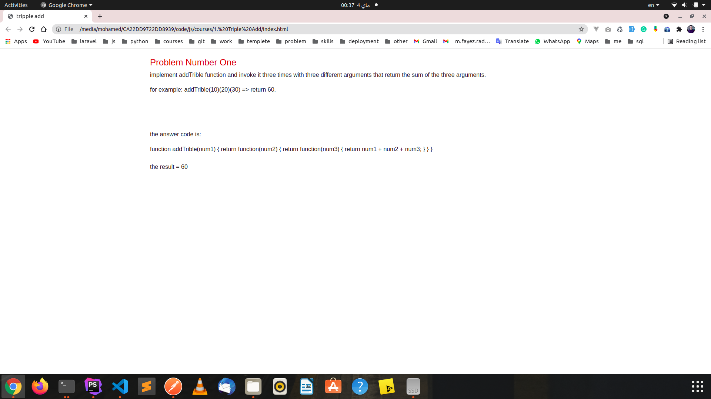
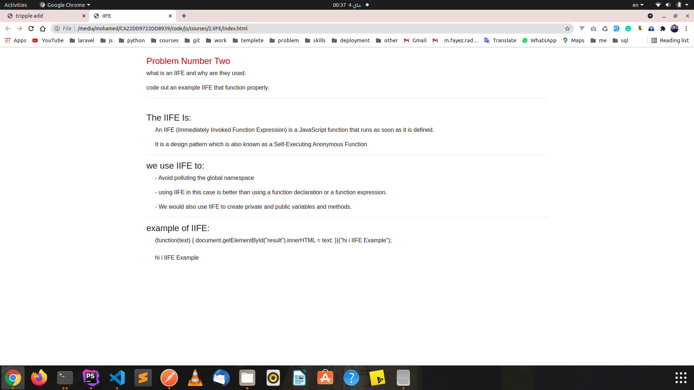

in this repository I will solve problem and interview questions with js 

each folder contain two files the first is index.html and the second is index.js

in index.html I write the questions and answer it

in index.js I write the js code to solve the problem 

for example 

